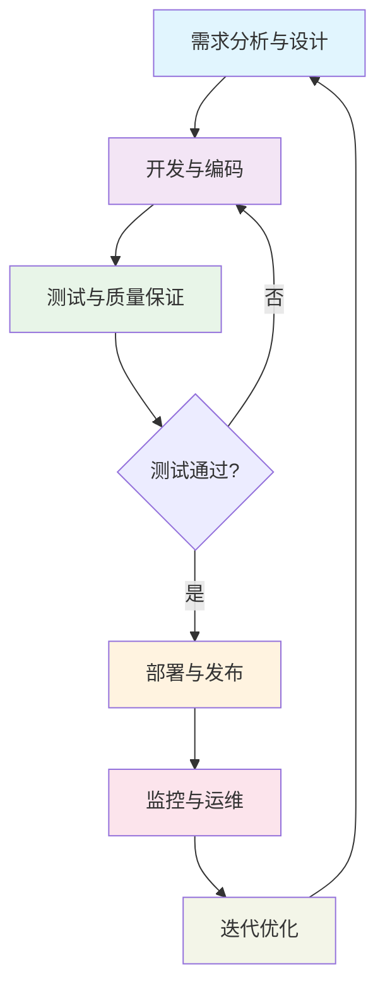
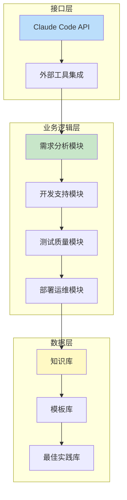

# Claude Code定制Skills在咨询项目中的应用白皮书设计

## 项目概述

本文档设计一篇面向混合受众（公司内部同事和潜在客户）的技术白皮书，展示战略咨询公司如何通过定制Claude Code Skills提升系统开发全流程效率，以此展示公司技术深度，获取潜在提案机会。

### 核心需求
- **目标受众**：混合受众（内部同事 + 现有客户 + 潜在客户）
- **文章格式**：技术白皮书/深度分析（2000-3000字）
- **展示内容**：系统开发全阶段（设计、coding、测试、部署上线、运营维护）
- **Skills类型**：定制开发skills
- **业务领域**：无特定限制（通用系统开发流程）
- **价值主张**：展示技术能力
- **文章风格**：混合平衡型（兼顾技术和业务）
- **视觉元素**：Mermaid格式流程图，尽量减少token消耗
- **多语言要求**：相同目录下保存日语版本，内容不需大量改动

## 文章结构设计

### 1. 引言：AI驱动的咨询服务新范式（约300字）
- **开场白**：人工智能技术如何重塑传统咨询行业
- **核心观点**：定制Claude Code Skills是技术深度与业务理解的最佳结合点
- **文章目的**：展示公司如何通过定制Skills提升系统开发全流程效率和质量
- **读者价值**：帮助读者理解AI工具在复杂系统开发中的战略价值

### 2. 系统开发全阶段概述（约400字 + Mermaid流程图）
- **生命周期定义**：端到端系统开发的六个关键阶段
- **阶段划分**：
  1. 需求分析与设计阶段
  2. 开发与编码阶段  
  3. 测试与质量保证阶段
  4. 部署与发布阶段
  5. 监控与运维阶段
  6. 迭代优化阶段
- **流程关系**：各阶段之间的依赖关系和迭代循环
- **可视化**：Mermaid流程图展示完整工作流

### 3. 第一阶段：需求分析与设计（约500-600字 + Mermaid子流程图）
- **业务挑战**：需求不明确、利益相关者沟通障碍、技术可行性评估困难
- **定制Skills解决方案**：
  - **需求澄清Skill**：通过自然语言对话帮助客户澄清和结构化需求
  - **架构设计Skill**：基于需求自动生成技术架构图和设计文档
  - **技术评估Skill**：评估不同技术栈的优缺点和可行性
- **客户价值**：减少需求误解、加速设计过程、提高技术决策质量
- **工作流程图**：展示需求分析到设计确认的详细流程

### 4. 第二阶段：开发与测试（约500-600字 + Mermaid子流程图）
- **业务挑战**：开发效率瓶颈、代码质量不一致、测试覆盖不足
- **定制Skills解决方案**：
  - **代码生成Skill**：基于设计文档生成高质量代码框架
  - **代码审查Skill**：自动化代码质量检查和最佳实践验证
  - **测试用例生成Skill**：基于需求自动生成测试用例和场景
  - **持续集成Skill**：自动化构建、测试和代码集成流程
- **客户价值**：提高开发效率、确保代码质量、减少回归缺陷
- **工作流程图**：展示开发到测试的迭代流程

### 5. 第三阶段：部署与运营维护（约500-600字 + Mermaid子流程图）
- **业务挑战**：部署复杂性、生产环境稳定性、运维效率低下
- **定制Skills解决方案**：
  - **部署自动化Skill**：自动化部署流程和环境配置
  - **监控告警Skill**：实时监控系统健康状态和性能指标
  - **故障诊断Skill**：基于日志和监控数据的智能故障分析
  - **容量规划Skill**：基于使用模式的资源优化建议
- **客户价值**：提高系统可靠性、减少运维成本、优化资源利用
- **工作流程图**：展示部署到运维的完整生命周期

### 6. 定制Skills架构与技术优势（约400字 + Mermaid架构图）
- **技术架构**：定制Skills的分层架构设计
  - **接口层**：与Claude Code和现有工具的集成接口
  - **业务逻辑层**：各阶段专属的业务逻辑实现
  - **数据层**：知识库、模板库和最佳实践库
- **集成策略**：如何与客户现有技术栈无缝集成
- **扩展性设计**：模块化架构支持快速扩展新功能
- **安全性考虑**：数据安全和访问控制机制

### 7. 结论：技术能力转化为客户价值（约300字）
- **技术能力总结**：端到端系统开发全流程的专业能力
- **业务价值体现**：
  - **效率提升**：通过自动化减少人工工作，加速项目交付
  - **质量保证**：通过标准化流程和最佳实践提高交付质量
  - **风险降低**：通过早期验证和持续监控减少项目风险
  - **成本优化**：通过资源优化和流程改进降低总体成本
- **合作展望**：邀请客户探讨具体业务场景和应用机会
- **行动呼吁**：提供技术咨询和定制Skills开发服务

## 视觉元素规划

### 流程图设计（全部使用Mermaid格式）
1. **图1**：系统开发全阶段总流程图（已包含）
2. **图2**：需求分析与设计阶段详细流程图
3. **图3**：开发与测试阶段详细流程图  
4. **图4**：部署与运营维护阶段详细流程图
5. **图5**：定制Skills技术架构图（已包含）

### 表格设计
1. **表1**：各阶段业务挑战与定制Skills解决方案对比表
2. **表2**：定制Skills在典型咨询项目中的投资回报分析

## 内容策略

### 技术深度与业务价值的平衡
- **技术描述**：详细说明定制Skills的工作原理和实现机制
- **业务关联**：始终强调技术如何解决具体业务问题
- **案例引用**：使用通用但具体的场景说明应用价值
- **数据支撑**：提供量化的效率提升和质量改进数据

### 受众适应性
- **技术决策者**：关注架构设计、集成能力和技术优势
- **业务决策者**：关注投资回报、风险降低和效率提升
- **内部团队**：关注工作流程改进和技能提升机会

## 实施计划

### 第一阶段：内容创作（预计2-3天）
1. 撰写中文版白皮书正文内容
2. 创建所有Mermaid流程图和表格
3. 内部技术评审和内容优化

### 第二阶段：多语言适配（预计1-2天）
1. 将中文内容翻译为日语版本
2. 确保技术术语的准确性和一致性
3. 文化适配：调整案例和表达方式以适合日本市场

### 第三阶段：格式化和发布（预计1天）
1. 应用公司品牌样式和格式
2. 生成PDF和Web版本
3. 制定发布和推广计划

## 成功标准

### 内容质量标准
- ✅ 完整覆盖系统开发全阶段
- ✅ 清晰展示定制Skills的技术架构
- ✅ 有效平衡技术深度和业务价值
- ✅ 提供可操作的见解和建议

### 业务目标标准  
- ✅ 展示公司技术能力和创新思维
- ✅ 为潜在提案机会创造切入点
- ✅ 建立行业技术领导力形象
- ✅ 促进内部知识分享和技能提升

## 风险管理

### 内容风险
- **技术过于复杂**：通过清晰的解释和可视化降低理解门槛
- **案例不够具体**：使用通用但详细的场景说明应用价值
- **价值主张不清晰**：每章节明确总结客户价值

### 实施风险
- **时间不足**：优先完成核心章节，可选内容作为扩展
- **资源限制**：利用现有模板和工具加速内容创建
- **质量不一致**：建立内容评审和标准化流程

---

*设计完成日期：2026-04-07*  
*下一步：用户审查设计文档，确认后开始内容创作*