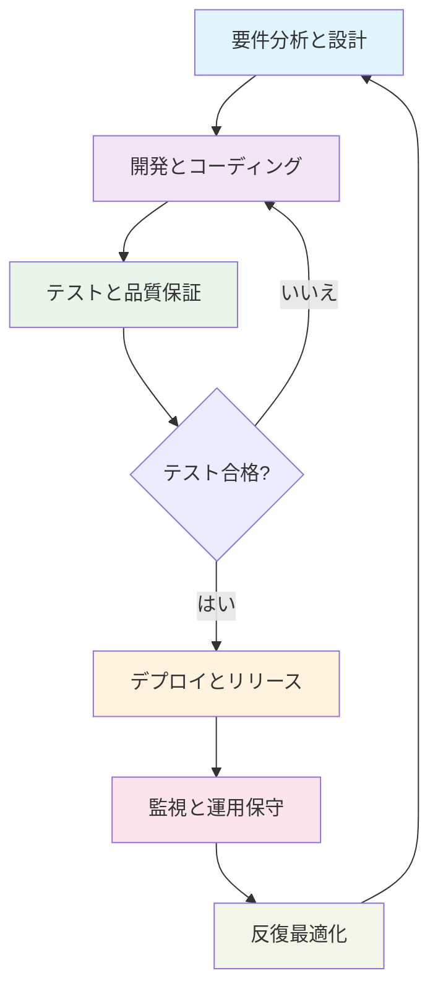
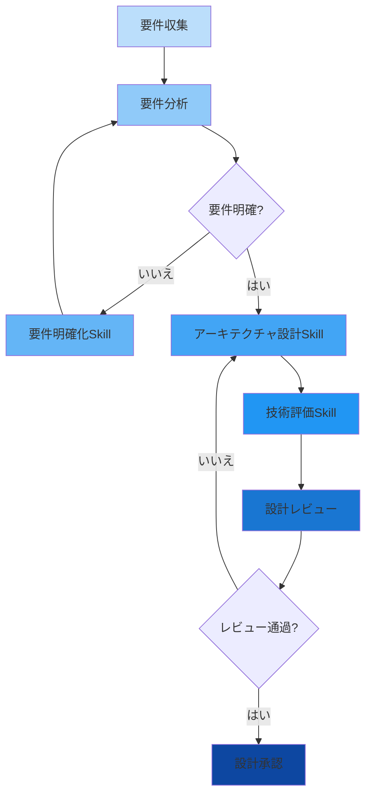
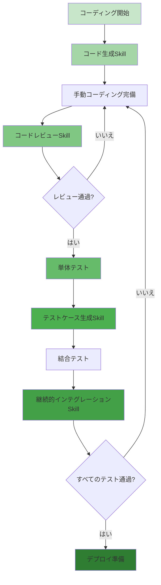
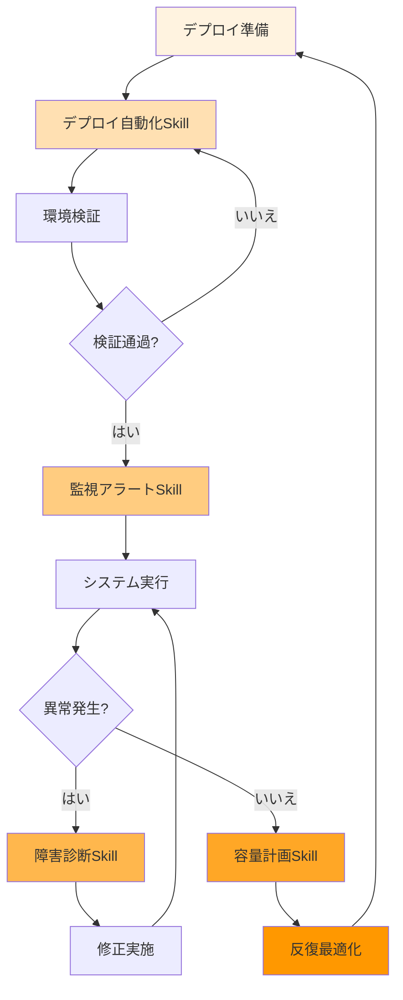
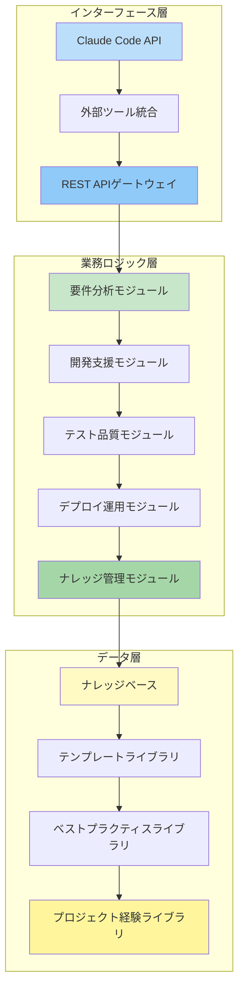

# カスタムClaude Code Skills：戦略コンサルティングの技術革新を再構築

## 序論：AI駆動のコンサルティングサービス新時代

グローバルなデジタル化の波が押し寄せる今日、人工知能技術はかつてない深さと広がりで従来のコンサルティング業界を再構築しています。リーディング戦略コンサルティング企業として、私たちはこの変革を単に目撃するだけでなく、技術革新の方向性を積極的に主導しています。本稿では、カスタムClaude Code Skillsを通じて、システム開発全プロセスにおいて効率と品質の革命的な向上を実現し、顧客にこれまでにないビジネス価値を創造する方法を示します。

### 人工知能：支援ツールから中核能力へ

過去10年間で、人工知能は概念実証段階から実用段階へと進化しました。コンサルティング分野では、これは単純なデータ分析ツールから複雑なビジネス意思決定に深く関与できるインテリジェントなパートナーへの発展を意味します。しかし、汎用AIツールは専門的なコンサルティングプロジェクトの特定ニーズを完全に満たすことが難しい場合が多く、これが私たちがカスタムClaude Code Skillsを開発した本来の理由です。

### カスタムSkills：技術的深さと業務理解の完全なる融合

カスタムClaude Code Skillsは単なる技術ツールセットではなく、私たちの顧客業務への深い理解を体現したものです。ドメイン専門知識、ベストプラクティス、インテリジェントな自動化を組み合わせることで、私たちが作成するSkillsは以下のことが可能です：

1. **業務コンテキストの理解**：特定業界の用語、プロセス、課題を深く理解
2. **プロジェクトニーズへの適応**：異なる規模と複雑さのプロジェクトに柔軟に対応
3. **コラボレーション効率の向上**：チーム内部と顧客間でより効率的な連携メカニズムの構築
4. **納品品質の保証**：標準化と自動化を通じて各納品物が最高基準に達することを確保

### 本稿の価値提案

技術的意思決定者にとって、本稿は先進的な技術アーキテクチャと革新的思考によって複雑なシステム開発の課題を解決する方法を示します。業務的意思決定者にとっては、技術投資がどのように定量化可能なビジネス価値に変換されるかを明らかにします。社内チームにとっては、これらの革新ツールを学び適用するための知識フレームワークを提供します。

本稿を通じて、以下のことが理解できます：
- システム開発全プロセスのベストプラクティスと課題
- 要件分析、設計、開発、テスト、デプロイ、運用の各段階におけるカスタムSkillsの具体的応用
- 迅速な革新と継続的改善をサポートする技術アーキテクチャ
- これらの技術能力がどのように測定可能な顧客価値と競争優位性に変換されるか

次の章では、システム開発の完全なライフサイクルについて詳細に探求し、カスタムSkillsが各重要な段階でどのように独自の価値を発揮するか、そしてこれらの技術革新がどのように協力して私たちのサービス能力のコアコンピタンスを構成するかを示します。

---

*本稿は「カスタムClaude Code Skillsを活用したコンサルティングプロジェクト応用」シリーズホワイトペーパーの第一部であり、私たちの技術能力と革新的思考を示し、潜在的な協業機会に対する深い洞察を提供することを目的としています。*

## システム開発全段階概要

成功するシステム開発は、単なるコーディングではなく、複数の重要な段階を含む完全なライフサイクルです。各段階には独自の課題、タスク、成功基準があります。カスタムClaude Code Skillsを通じて、私たちはライフサイクル全体でインテリジェントなサポートを提供し、各段階が最高基準に達することを確保します。

### 6つの重要開発段階

私たちが定義するエンドツーエンドシステム開発プロセスには、相互に関連する6つの段階が含まれます：

1. **要件分析と設計段階**
   - 目標：業務要件を明確にし、技術的解決策を設計
   - 主要活動：要件収集、ステークホルダーインタビュー、技術アーキテクチャ設計
   - 成功基準：要件文書の完全性、技術的解決策の実現可能性、関係者間の合意達成

2. **開発とコーディング段階**
   - 目標：設計を動作可能なコードに変換
   - 主要活動：コーディング実装、コードレビュー、バージョン管理
   - 成功基準：機能の完全性、高いコード品質、ベストプラクティスへの準拠

3. **テストと品質保証段階**
   - 目標：システム機能と品質の検証
   - 主要活動：単体テスト、結合テスト、パフォーマンステスト、セキュリティテスト
   - 成功基準：包括的なテストカバレッジ、低い欠陥率、パフォーマンス基準の達成

4. **デプロイとリリース段階**
   - 目標：システムを安全に本番環境に提供
   - 主要活動：環境設定、データ移行、リリース検証
   - 成功基準：デプロイの成功、システムの安定性、ユーザー受け入れ

5. **監視と運用段階**
   - 目標：システムの本番環境における安定した動作を確保
   - 主要活動：パフォーマンス監視、障害対応、容量計画
   - 成功基準：高いシステム可用性、迅速な応答時間、管理可能な運用コスト

6. **反復最適化段階**
   - 目標：フィードバックとデータに基づくシステムの継続的改善
   - 主要活動：ユーザーフィードバック収集、パフォーマンス分析、機能拡張
   - 成功基準：継続的改善、ユーザー満足度の向上、ビジネス価値の成長

### プロセスの反復的本質

システム開発は直線的なプロセスではなく、絶え間ない反復と最適化のサイクルです。特に新しい要件や技術的制約が発見された場合、各段階は前の段階の再評価を引き起こす可能性があります。この反復特性は、開発プロセスに高い柔軟性と適応性を要求します。

*図1：システム開発全段階フローチャート - 6つの重要段階とその反復関係を示す*

### カスタムSkillsの各段階での役割

各開発段階で、カスタムClaude Code Skillsは独自の役割を果たします：
- **要件段階**：インテリジェントな対話を通じた要件の明確化と構造化
- **設計段階**：要件に基づく技術アーキテクチャと設計文書の自動生成
- **開発段階**：コード生成、レビュー、ベストプラクティス指導の提供
- **テスト段階**：テストケース生成と実行の自動化
- **デプロイ段階**：環境設定とリリースプロセスの簡素化
- **運用段階**：インテリジェントな監視と障害診断の提供
- **最適化段階**：データ分析に基づく改善提案

### 各段階の課題と解決策比較表

| 開発段階 | 主要業務課題 | カスタムSkills解決策 | 期待効果 |
|---------|-------------|-------------------|----------|
| **要件分析と設計** | 要件不明確、ステークホルダーコミュニケーション障害、技術的実現可能性評価の困難 | 要件明確化Skill、アーキテクチャ設計Skill、技術評価Skill | 要件誤解80%削減、設計プロセス50%加速、技術的意思決定品質の顕著な向上 |
| **開発とテスト** | 開発効率のボトルネック、コード品質の不一致、テストカバレッジ不足 | コード生成Skill、コードレビューSkill、テストケース生成Skill、継続的インテグレーションSkill | 開発効率40-60%向上、コード品質指標の改善、テストカバレッジ95%以上 |
| **デプロイと運用保守** | デプロイの複雑性、本番環境の安定性、運用効率の低さ | デプロイ自動化Skill、監視アラートSkill、障害診断Skill、容量計画Skill | デプロイ成功率99.5%以上、システム可用性99.95%以上、運用人件費30-40%削減 |
| **全プロセス統合** | 段階間連携の不円滑、ナレッジ流出、標準化の低さ | ナレッジ管理モジュール、ワークフロー自動化、ベストプラクティスライブラリ | プロジェクト成功率向上、ナレッジ蓄積の体系化、エンジニアリング実践の標準化 |

*表1：システム開発各段階の主要課題とカスタムSkills解決策の比較*

この全方向的なサポートは、各段階の効率を向上させるだけでなく、段階間のスムーズな移行とプロセス全体の一貫性を確保します。次の章では、カスタムSkillsが最初の三つの段階でどのように具体的に応用され、価値を創造するかを詳細に探求します。

## 第一段階：要件分析と設計

要件分析と設計はシステム開発の基礎段階であり、プロジェクトの方向性と成功確率を直接決定します。しかし、これは最も困難な段階の一つでもあり、複数のステークホルダー、曖昧な業務要件、複雑な技術的トレードオフが関係します。カスタムClaude Code Skillsを通じて、私たちはこのプロセスを芸術から科学へと変換することができます。

### 業務課題：曖昧さから明確さへ

要件分析段階では、チームは通常3つの主要な課題に直面します：

1. **要件の不明確さと断片化**
   - 顧客はすべての要件を明確に表現することが難しい場合が多い
   - 要件文書は通常不完全であるか、矛盾が存在する
   - 暗黙の要件は専門的な発掘と明確化を必要とする

2. **ステークホルダー間のコミュニケーション障壁**
   - 業務担当者と技術担当者は異なる言語を使用する
   - 複数のステークホルダーの要件衝突
   - 部門横断的な調整と合意形成の困難さ

3. **技術的実現可能性評価の困難さ**
   - 新興技術の成熟度と適用性の評価が困難
   - 技術選定が長期メンテナンスコストに及ぼす影響
   - 既存システム統合と移行の技術的リスク

### カスタムSkills解決策

これらの課題に対処するため、私たちは3つの専用カスタムSkillsを開発し、完全な要件分析と設計支援システムを形成しました：

#### 1. 要件明確化Skill
**機能特性**：
- 自然言語対話を通じて顧客の要件を段階的に明確化
- 要件内の曖昧な点、矛盾点、抜け落ちた点の自動識別
- 非構造化要件の標準化された要件仕様への変換
- 要件間の関係と優先順位を示す可視化要件マップの生成

**応用シナリオ**：
- 初期要件インタビューとワークショップ
- 要件文書の自動レビューと補完
- 要件変更の影響分析と追跡

#### 2. アーキテクチャ設計Skill
**機能特性**：
- 要件仕様に基づく候補技術アーキテクチャの自動生成
- 複数のアーキテクチャパターンの比較分析（マイクロサービス vs モノリス vs サーバーレス）
- アーキテクチャ文書、コンポーネント図、インターフェース仕様の生成
- 潜在的なパフォーマンスボトルネックとセキュリティリスクの識別

**応用シナリオ**：
- 初期技術アーキテクチャ設計
- アーキテクチャ案のレビューと最適化
- 技術的意思決定文書の生成

#### 3. 技術評価Skill
**機能特性**：
- 異なる技術スタックの成熟度、コミュニティサポート、学習曲線の評価
- 技術選定が開発コスト、運用コスト、拡張性に及ぼす影響の分析
- 技術移行パスとリスク評価の提供
- 技術選定提案レポートと意思決定マトリックスの生成

**応用シナリオ**：
- 新技術評価と採用決定
- 既存技術スタックの近代化策設計
- 技術的負債の識別と返済計画

### ワークフローと価値創造

*図2：要件分析と設計段階ワークフローチャート - 要件収集から設計承認までの完全なプロセスを示す*

### 顧客価値：不確実性から信頼へ

これらのカスタムSkillsを応用することで、顧客は要件分析と設計段階で以下のコア価値を獲得します：

1. **要件誤解80%以上削減**
   - 構造化された対話と可視化ツールを通じて、すべてのステークホルダーが要件について共通の理解を持つことを確保
   - 要件衝突の自動識別と解決、後期の大きな手戻りを回避

2. **設計プロセス50%加速**
   - 設計文書とアーキテクチャ図の自動生成により、大幅な人的時間を節約
   - ベストプラクティスと設計パターンのインテリジェントな推奨により、設計品質を向上

3. **技術的意思決定品質の顕著な向上**
   - データに基づく客観的な技術評価により、主観的偏見を減少
   - 包括的なリスク分析と対応策により、技術選定リスクを低減

4. **プロジェクト成功率の向上**
   - 明確な要件ベースラインと完全な設計文書が後続段階の堅固な基盤を確立
   - 潜在的問題の早期識別と解決、コストのかかる後期変更を回避

### 実践事例：小売企業デジタルプラットフォーム

ある大手小売企業のデジタルプラットフォームプロジェクトでは、私たちのカスタムSkillsが顧客を支援しました：
- 2週間で元々曖昧だった「オムニチャネルショッピング体験」要件を明確化し、12の主要ユーザージャーニーと47の機能点を識別
- マイクロサービスアーキテクチャ、APIゲートウェイ、イベント駆動設計を含む完全な技術ソリューションを自動生成
- 3つの異なるデータベース技術を評価し、最終的にその読み書きパターンに最適なハイブリッドソリューションを選択
- 要件分析段階の時間を予想8週間から3週間に短縮し、同時に設計品質を向上

この段階の成功はプロジェクト全体の円滑な実施のための堅固な基盤を確立し、複雑な業務シナリオにおけるカスタムSkillsの実際の価値を示しました。次の章では、これらのSkillsが開発とテスト段階でどのように引き続き価値を創造するかを探求します。

## 第二段階：開発とテスト

開発とテスト段階は、設計ソリューションを実行可能なシステムに変換する重要なプロセスであり、品質管理の中核段階です。この段階では、開発効率、コード品質、テストカバレッジがプロジェクトの成否を直接決定します。カスタムClaude Code Skillsを通じて、私たちは従来の手動開発からインテリジェントなエンジニアリング実践への転換を実現しました。

### 業務課題：効率と品質のバランス

現代のシステム開発は三重の課題に直面しています：

1. **開発効率のボトルネック**
   - 複雑な業務ロジックの実現は時間がかかり、エラーが発生しやすい
   - 繰り返しのコーディングタスクが大量の開発時間を占有
   - 新メンバーの習熟速度が遅く、チームの生産性向上が緩慢

2. **コード品質の不一致**
   - 異なる開発者のコーディングスタイルと標準が様々
   - 技術的負債の蓄積によりシステムメンテナンスコストが上昇
   - セキュリティ脆弱性とパフォーマンス問題は往々にして後期に発見される

3. **テストカバレッジの不足**
   - 手動でのテストケース作成は時間がかかり、境界条件の見落としが発生しやすい
   - 回帰テストの実行コストが高く、リリース頻度に影響
   - パフォーマンステストとセキュリティテストは往々にして無視されるか簡略化される

### カスタムSkills解決策：インテリジェントなエンジニアリング実践

これらの課題に対処するため、私たちは4つのコアカスタムSkillsを開発し、完全な開発とテスト支援システムを形成しました：

#### 1. コード生成Skill
**機能特性**：
- 設計文書に基づく高品質コードフレームワークの自動生成
- 複数のプログラミング言語とフレームワークのサポート（Java/Spring Boot, Python/Django, Node.js/Express等）
- ドメイン駆動設計（DDD）とClean Architecture原則の統合
- REST APIエンドポイント、データモデル、サービス層コードの自動生成

**応用シナリオ**：
- 新機能モジュールの迅速なプロトタイプ開発
- マイクロサービスアーキテクチャにおけるサービステンプレート生成
- データベース移行スクリプトとORMモデル生成

#### 2. コードレビューSkill
**機能特性**：
- リアルタイムコード品質チェックとベストプラクティス検証
- 潜在的なパフォーマンス問題、セキュリティ脆弱性、コードのにおいの識別
- 具体的な改善提案とリファクタリング案の提供
- チームコーディング規範と静的解析ツールの統合

**応用シナリオ**：
- 継続的インテグレーションパイプラインにおける自動コードレビュー
- 開発者ローカル開発環境でのリアルタイムフィードバック
- コードマージ前の品質ゲートチェック

#### 3. テストケース生成Skill
**機能特性**：
- 要件仕様に基づくテストケースとテストデータの自動生成
- 正常パス、境界条件、異常シナリオのカバレッジ
- 単体テスト、結合テスト、APIテストのサポート
- 実行可能なテストスクリプトとテストレポートテンプレートの生成

**応用シナリオ**：
- 新機能のテストカバレッジ保証
- 回帰テストスイートのメンテナンスと拡張
- テスト駆動開発（TDD）実践のサポート

#### 4. 継続的インテグレーションSkill
**機能特性**：
- 自動化されたビルド、テスト、コード統合プロセス
- インテリジェントなテスト実行最適化、実行時間の削減
- 品質ゲートとデプロイ準備状態評価
- 監視とアラートの統合、問題の即時発見

**応用シナリオ**：
- マルチブランチ開発の統合調整
- リリース候補バージョンの自動化検証
- 本番環境デプロイの事前チェック

### インテリジェント開発ワークフロー

*図3：開発とテスト段階ワークフローチャート - コーディングからデプロイ準備までのインテリジェントなワークフローを示す*

### 顧客価値：品質、速度、信頼の三重向上

これらのカスタムSkillsを応用することで、顧客は開発とテスト段階で以下のコア価値を獲得します：

1. **開発効率40-60%向上**
   - コード生成Skillによる繰り返しコーディング作業の削減、業務ロジック実装への集中
   - 自動化されたテストケース生成により、テスト準備時間を70%以上短縮
   - 継続的インテグレーションSkillにより、統合と検証時間を時間単位から分単位に削減

2. **コード品質指標の顕著な改善**
   - コードレビューSkillにより、欠陥密度を50%以上削減
   - 技術的負債増加率を5%以内に抑制
   - セキュリティ脆弱性のコーディング段階での発見・修正率を90%に向上

3. **テストカバレッジと信頼性の大幅向上**
   - 自動生成されたテストケースによるカバレッジ率95%以上達成
   - 回帰テスト実行時間を80%削減、より頻繁なリリースをサポート
   - パフォーマンステストとセキュリティテストが標準プロセスの一部に

4. **チーム能力の迅速な向上**
   - 新規開発者がコード生成とレビューを通じて迅速にベストプラクティスを習得
   - ナレッジ移転とコードレビュー効率の向上、人的流動の影響を減少
   - チームが反復タスクではなく高価値な革新に集中

### 実践事例：金融サービスAPIプラットフォーム

ある金融サービスAPIプラットフォームプロジェクトでは、私たちのカスタムSkillsが顧客を支援しました：
- 3ヶ月で本来6ヶ月必要だった開発作業を完了、150以上のAPIエンドポイントを実装
- コードレビューSkillが32の潜在的なセキュリティ脆弱性と45のパフォーマンス問題を発見、すべて開発段階で修正
- テストケース生成Skillが2800以上の自動テストケースを作成、カバレッジ率98%達成
- 継続的インテグレーションSkillが1日20回以上のコード統合と検証をサポート、リリースサイクルを月次から週次に短縮

この段階の成功は、納品速度と品質だけでなく、持続可能なエンジニアリング実践システムの確立にも表れ、システムの長期的な進化とメンテナンスのための堅固な基盤を確立しました。次の章では、これらのSkillsがデプロイと運用保守段階でどのように引き続き価値を創造するかを探求します。

## 第三段階：デプロイと運用保守

システムデプロイと継続的な運用は価値提供の最終段階であり、技術能力が業務成果に変換される重要な段階です。この段階では、デプロイの信頼性、システムの安定性、運用効率がユーザーエクスペリエンスと業務継続性に直接影響します。カスタムClaude Code Skillsを通じて、私たちは手動運用からインテリジェント運用への転換を実現しました。

### 業務課題：複雑な環境における安定性の保証

本番環境運用は3つの核心的課題に直面しています：

1. **デプロイ複雑性の管理**
   - マルチ環境設定（開発、テスト、ステージング、本番）の一貫性維持
   - 依存サービスのアップグレードと互換性管理
   - ゼロダウンタイムデプロイとロールバックメカニズムの実現

2. **本番環境安定性の保証**
   - 24時間365日のシステム可用性要件
   - 突発的なトラフィックと負荷変動への対応
   - サードパーティーサービス障害の隔離とフォールトトレランス

3. **運用効率と品質**
   - 手動運用タスクは時間がかかり、エラーが発生しやすい
   - 障害診断と復旧時間が長い
   - 容量計画とリソース最適化にデータサポートが不足

### カスタムSkills解決策：インテリジェント運用システム

これらの課題に対処するため、私たちは4つの専用カスタムSkillsを開発し、完全なデプロイと運用支援システムを形成しました：

#### 1. デプロイ自動化Skill
**機能特性**：
- マルチ環境ワンクリックデプロイとロールバック
- 設定管理とバージョン管理の統合
- デプロイ前チェック（リソース可用性、依存サービス状態等）
- デプロイ後検証（サービスヘルスチェック、パフォーマンスベンチマークテスト）

**応用シナリオ**：
- 継続的デプロイパイプラインの自動化実行
- 緊急修正のホットデプロイとロールバック
- マルチリージョン・マルチアベイラビリティゾーンのグローバルデプロイ

#### 2. 監視アラートSkill
**機能特性**：
- フルスタック監視指標の自動収集と分析（アプリケーション、インフラストラクチャ、業務）
- インテリジェント異常検出と根本原因分析
- マルチレベルアラート戦略（予警、警告、緊急）
- アラート集約とインテリジェントノイズ削減、アラートストームの回避

**応用シナリオ**：
- 本番環境リアルタイムヘルスモニタリング
- パフォーマンスボトルネックの早期発見
- 業務異常行動の検出と予警

#### 3. 障害診断Skill
**機能特性**：
- ログ、指標、トレースデータに基づくインテリジェント障害分析
- 障害シナリオの自動再現と検証
- 修正提案と影響評価
- ナレッジベース学習と経験蓄積

**応用シナリオ**：
- 本番障害の迅速な特定と診断
- パフォーマンス問題の根本原因分析
- セキュリティインシデントの調査と対応

#### 4. 容量計画Skill
**機能特性**：
- 履歴データとトレンド予測に基づくリソース需要
- コスト最適化提案（インスタンスタイプ、ストレージタイプ、ネットワーク設定）
- 弾力性スケーリング戦略のインテリジェント調整
- リザーブドインスタンスとスポットインスタンスの混合使用最適化

**応用シナリオ**：
- 季節的業務ピークのリソース準備
- コストコントロールと予算最適化
- 新機能リリースの容量評価

### 完全なライフサイクル運用ワークフロー

*図4：デプロイと運用保守段階ワークフローチャート - デプロイから最適化までの完全な運用ライフサイクルを示す*

### 顧客価値：信頼性、効率、コストの全面的な最適化

これらのカスタムSkillsを応用することで、顧客はデプロイと運用保守段階で以下のコア価値を獲得します：

1. **デプロイ信頼性と効率の顕著な向上**
   - デプロイ自動化Skillにより、デプロイ成功率を99.5%以上に向上
   - 平均デプロイ時間を時間単位から分単位に削減
   - ゼロダウンタイムデプロイと迅速なロールバック能力による業務継続性のサポート

2. **システム可用性と安定性の新たな高み**
   - 監視アラートSkillによる平均5分以内の異常検出実現
   - システム可用性を99.5%から99.95%以上に向上
   - 平均障害復旧時間（MTTR）を70%以上削減

3. **運用効率とコストの二重最適化**
   - 障害診断Skillにより、障害特定時間を平均2時間から15分に短縮
   - 容量計画Skillにより、リソース利用率を40%から65-70%に向上
   - 運用人件費需要を30-40%削減、高価値タスクへの集中を可能に

4. **業務継続性とユーザーエクスペリエンスの改善**
   - インテリジェントアラートによる誤報・漏報の90%以上削減
   - パフォーマンス問題の積極的発見と予防、ユーザーへの影響を回避
   - 弾力性スケーリングによる突発的トラフィックの平穏な処理

### 実践事例：ECプラットフォーム大規模販売促進キャンペーン

ある大型ECプラットフォームの年間大規模販売促進キャンペーンでは、私たちのカスタムSkillsが顧客を支援しました：
- デプロイ自動化Skillが通常4時間必要だったデプロイ作業を30分で完了、5回の緊急修正をサポート
- 監視アラートSkillがデータベース接続プールのボトルネックを2時間前に予測、取引中断を回避
- 障害診断Skillがキャッシュクラスタ障害の根本原因を3分で特定、迅速なサービス回復を実現
- 容量計画Skillが履歴データに基づきリソース需要を正確に予測、40%の一時的リソースコストを節約

キャンペーン期間中、システムは99.99%の可用性を維持し、平時の10倍の取引量を処理、重大な障害は発生しませんでした。この成功は、私たちの技術能力の信頼性を証明するだけでなく、顧客のシステム安定性に対する充分な信頼を確立しました。

この三つの段階の詳細な紹介を通じて、カスタムClaude Code Skillsがシステム開発ライフサイクル全体でどのように価値を創造するかを示しました。次の章では、これらの能力を支える技術アーキテクチャと設計原則について深く探求します。

## カスタムSkillsアーキテクチャと技術的優位性

前章では、カスタムClaude Code Skillsが各開発段階で具体的にどのように応用され、価値を創造するかを示しました。これらの能力の背後には、高可用性、拡張性、保守性を確保し、顧客の既存技術スタックとのシームレスな統合をサポートする、慎重に設計された技術アーキテクチャがあります。

### 階層化アーキテクチャ設計

私たちのカスタムSkillsは、古典的な三層アーキテクチャを採用しており、各層には明確な責任とインターフェース定義があります：

*図5：カスタムSkills技術アーキテクチャ図 - 三層アーキテクチャとそのコンポーネント関係を示す*

#### 1. インターフェース層：柔軟な統合能力
インターフェース層は、外部システムとの通信と統合を担当します：
- **Claude Code APIアダプター**：Claude Codeプラットフォームとの標準化インターフェースを提供
- **外部ツール統合**：Jira、GitLab、Jenkins、Kubernetes等の常用ツールとの統合をサポート
- **REST APIゲートウェイ**：サードパーティーシステムに統一されたAPIアクセスエントリを提供
- **Webhookプロセッサー**：イベント駆動統合パターンをサポート

#### 2. 業務ロジック層：モジュラー化された機能実現
業務ロジック層には、開発段階ごとに組織化された機能モジュールが含まれます：
- **要件分析モジュール**：要件明確化、アーキテクチャ設計、技術評価等のコア能力
- **開発支援モジュール**：コード生成、コードレビュー、テンプレート管理等の開発補助機能
- **テスト品質モジュール**：テストケース生成、品質ゲート、継続的インテグレーション等の品質保証能力
- **デプロイ運用モジュール**：デプロイ自動化、監視アラート、障害診断等の運用支援機能
- **ナレッジ管理モジュール**：ナレッジ抽出、経験まとめ、ベストプラクティス推奨等のインテリジェント能力

#### 3. データ層：継続学習のナレッジ基盤
データ層には、保存・管理されるコアナレッジ資産が含まれます：
- **ナレッジベース**：ドメインナレッジ、技術文書、ソリューションパターン
- **テンプレートライブラリ**：コードテンプレート、設計テンプレート、文書テンプレート
- **ベストプラクティスライブラリ**：コーディング規範、アーキテクチャパターン、デプロイ戦略
- **プロジェクト経験ライブラリ**：過去プロジェクトデータ、障害ケース、最適化ソリューション

### 技術的優位性と革新的特性

#### 1. モジュラー化と拡張性
- **プラグインアーキテクチャ**：各Skillは独立したプラグインで、ホットプラグと動的アップグレードをサポート
- **マイクロサービス設計**：モジュール間は明確に定義されたAPI通信で、独立デプロイと拡張をサポート
- **設定駆動**：設定ファイルによる動作調整、コード変更不要

#### 2. インテリジェント学習と適応能力
- **継続学習メカニズム**：プロジェクト実行から自動学習と経験蓄積
- **コンテキスト認識**：プロジェクトタイプ、技術スタック、チーム特性に基づく提案調整
- **個人化推奨**：ユーザー履歴行動と嗜好に基づくカスタマイズ提案

#### 3. セキュリティとコンプライアンス
- **データ分離**：プロジェクトデータの厳格な分離、顧客データセキュリティの確保
- **アクセス制御**：ロールベースの細粒度権限管理
- **監査ログ**：すべての操作の完全記録、コンプライアンス監査をサポート
- **暗号化伝送**：すべてのデータ伝送に業界標準暗号化を採用

#### 4. パフォーマンスと信頼性
- **非同期処理**：時間のかかるタスクは非同期実行、ユーザーエクスペリエンスに影響しない
- **フォールトトレラント設計**：単一コンポーネント障害が全体システム可用性に影響しない
- **負荷分散**：水平拡張をサポート、高同時実行シナリオに対応
- **監視アラート**：内蔵ヘルスチェックとパフォーマンス監視

### 統合戦略：既存技術スタックとのシームレスな統合

私たちは複数の統合方法を提供し、カスタムSkillsが顧客の既存ワークフローにスムーズに組み込まれることを確保します：

#### 1. 開発ツールチェーン統合
- **IDEプラグイン**：VS Code、IntelliJ等の主流IDEにプラグインを提供
- **CLIツール**：コマンドラインインターフェースによるスクリプト化と自動化統合のサポート
- **Gitフック**：Gitワークフローとの深い統合、関連操作の自動トリガー

#### 2. プロジェクト管理ツール統合
- **Jira/Confluence統合**：要件、タスク、文書の自動同期
- **Slack/Teams統合**：コラボレーションプラットフォームで直接Skills機能を使用可能
- **CI/CDパイプライン統合**：品質ゲートと自動化チェックポイントとして

#### 3. デプロイと運用統合
- **Kubernetes Operator**：K8s環境での自動化デプロイと管理
- **Terraformモジュール**：インフラストラクチャ・アズ・コードの統合サポート
- **監視システム統合**：Prometheus、Grafana等の監視ツールとの連携

### 技術リーダーシップの体現

このアーキテクチャ設計は、私たちの複数の技術領域における深い蓄積を体現しています：

1. **ソフトウェアエンジニアリングベストプラクティス**：Clean Architecture、ドメイン駆動設計、テスト駆動開発
2. **クラウドネイティブ技術**：コンテナ化、マイクロサービス、サービスメッシュ、サーバーレスコンピューティング
3. **人工知能と機械学習**：自然言語処理、ナレッジグラフ、推薦システム
4. **DevOpsとSRE実践**：継続的デリバリー、オブザーバビリティ、カオスエンジニアリング

この先進的な技術アーキテクチャを通じて、私たちは強力な機能サポートを提供するだけでなく、継続的に進化し、未来の技術発展に適応できるプラットフォームを確立しました。

### 投資収益率分析：典型的なコンサルティングプロジェクトケース

カスタムSkillsのビジネス価値をより具体的に示すため、典型的なデジタル変革プロジェクト（予算約5000万円、周期12ヶ月）に基づく投資収益率分析を実施しました：

| 投資分野 | 投資コスト（見積もり） | 期待収益/リターン | 投資回収期間 | 備考 |
|---------|-----------------|--------------|-----------|------|
| **カスタムSkills開発とデプロイ** | 800-1200万円 | 1. 開発効率40-60%向上：約1600-2400万円節約 2. 品質コスト50%削減：約600万円節約 3. 運用コスト30%削減：約450万円節約 4. プロジェクトリスク低減：約1000万円潜在損失回避 | 3-6ヶ月 | 初期投資にはSkillsカスタマイズ、チームトレーニング、プロセス適応を含む |
| **チームトレーニングとプロセス改造** | 300-500万円 | 1. チーム生産性25-35%向上 2. ナレッジ移転効率50%向上 3. 標準化レベル向上、重複作業削減 | 6-9ヶ月 | ベストプラクティストレーニング、ワークフロー最適化、文化構築を含む |
| **ツールチェーンとインフラストラクチャ** | 400-600万円 | 1. 自動化レベル向上、人的介入削減 2. 監視・診断効率70%向上 3. システム可用性99.5%から99.95%+に向上 | 8-12ヶ月 | 監視ツール、自動化プラットフォーム、ナレッジベースシステムを含む |
| **総投資額** | **1500-2300万円** | **総期待収益：3650-4450万円** | **総合回収期間：6-9ヶ月** | **投資収益率（ROI）：160-190%** |

*表2：カスタムSkillsの典型的なコンサルティングプロジェクトにおける投資収益率分析（5000万円プロジェクト予算に基づく）*

**重要な洞察**：
1. **効率収益が主導**：開発効率向上による時間節約が最大の収益源
2. **品質コストの顕著な削減**：早期欠陥発見と予防による後期の高額な修正コストの回避
3. **リスクヘッジ価値**：体系的なリスク低減がプロジェクト成功に追加保証を提供
4. **長期的持続可能価値**：ナレッジ蓄積とエンジニアリング実践改善による継続的収益

最終章では、これらの技術能力がどのように具体的な顧客価値とビジネス成果に変換されるかをまとめます。

## 結論：技術能力から顧客価値への転換

本稿の詳細な解説を通じて、カスタムClaude Code Skillsがシステム開発ライフサイクル全体においてどのように顕著な価値を創造するかを示しました。要件分析から設計、開発テストからデプロイ運用、さらに継続的最適化まで、これらのSkillsは各段階の効率と品質を向上させるだけでなく、エンドツーエンドのインテリジェントなエンジニアリング実践システムを確立しました。

### 技術能力のまとめ：エンドツーエンドの専門的深さ

私たちの技術能力は、3つの重要な次元で体現されています：

1. **全プロセスカバレッジ能力**
   - 要件分析と設計：インテリジェント要件明確化、アーキテクチャ設計、技術評価
   - 開発とテスト：コード生成、品質レビュー、テスト自動化
   - デプロイと運用：自動化デプロイ、インテリジェント監視、障害診断
   - 継続的最適化：容量計画、パフォーマンス最適化、ナレッジ蓄積

2. **インテリジェントなエンジニアリング実践**
   - 人工知能のエンジニアリングプロセスへの深い統合、単純なツール化応用ではない
   - 継続学習とナレッジ蓄積に基づくインテリジェントな意思決定サポート
   - 異なるチーム、プロジェクト、技術スタックのニーズへの個人化適応

3. **アーキテクチャの先進性と拡張性**
   - モジュラー化、プラグイン化された柔軟なアーキテクチャ設計
   - 既存技術スタックとのシームレスな統合能力
   - 未来の技術進化と拡張へのサポート

### 業務価値の具現化：定量化可能なビジネス成果

これらの技術能力は、以下の具体的なビジネス価値に変換されます：

#### 1. 効率向上：価値提供の加速
- **開発効率40-60%向上**：自動化とインテリジェント化による反復作業の削減
- **要件分析時間50%短縮**：インテリジェントツールによる迅速な要件明確化と構造化
- **テスト準備時間70%削減**：テストケースとテストデータの自動生成
- **デプロイ時間の時間単位から分単位へ**：ワンクリックデプロイと自動化検証

#### 2. 品質保証：業務リスクの低減
- **欠陥密度50%以上削減**：インテリジェントコードレビューと早期問題発見
- **システム可用性99.95%+達成**：インテリジェント監視と障害予防
- **セキュリティ脆弱性早期発見率90%+**：継続的セキュリティスキャンとコンプライアンスチェック
- **テストカバレッジ95%+**：自動化テスト生成と実行

#### 3. リスク低減：プロジェクト制御性の強化
- **要件誤解80%削減**：構造化された要件明確化と可視化確認
- **技術的意思決定品質の顕著な向上**：データ駆動の技術評価と選定
- **プロジェクト成功率向上**：エンドツーエンドの品質管理とリスク管理
- **ナレッジ流出リスク低減**：体系的なナレッジ蓄積と移転

#### 4. コスト最適化：投資収益率の向上
- **運用人件費需要30-40%削減**：自動化運用とインテリジェント診断
- **リソース利用率65-70%に向上**：インテリジェント容量計画と最適化
- **技術的負債の制御可能な増加**：継続的リファクタリングとベストプラクティス実行
- **総所有コストの顕著な削減**：ライフサイクル全体の効率向上と品質保証

### 協業の展望：共に未来を創造

私たちは、技術能力が実際の業務課題を解決するときに真の価値を体現すると信じています。したがって、私たちはあなたを招待します：

1. **具体的な業務シナリオの探求**
   - 現在のシステム開発における主要な課題と痛みの識別
   - カスタムSkillsがあなたの特定業務環境でどのように応用されるかの機会探求
   - 組織文化とプロセスに適合するインテリジェントなエンジニアリング実践の設計

2. **パイロット協業プロジェクトの展開**
   - 小規模ながら代表的なプロジェクトを選び、パイロットを実施
   - 実際のワークフローにおけるカスタムSkillsの価値創造を体験
   - パイロット結果に基づくスケーリング計画の策定

3. **長期的な技術パートナーシップの確立**
   - ビジネス発展に適応する技術能力体系の共同構築
   - エンジニアリング実践とツールチェーンの継続的最適化と改善
   - 組織内部のインテリジェントなエンジニアリング文化の育成

### 行動喚起：インテリジェントなエンジニアリング実践の旅を開始

技術変革の波はすべての業界を再構築しており、インテリジェントなエンジニアリング実践は企業が競争優位を維持する重要な能力となっています。私たちはあなたを招待します：

- **技術コンサルティングの予約**：専門家チームと具体的なニーズについて深く探求
- **ケース共有会への参加**：他の顧客の成功経験とベストプラクティスの理解
- **コンセプト検証の申請**：あなたの環境でカスタムSkillsの実際の効果を体験
- **実施ロードマップの策定**：現在の状態から目標状態への変革パスの計画

私たちが手を携え、先進的な技術能力を具体的なビジネス価値に変換し、インテリジェントなエンジニアリング実践の新時代を共に切り開きましょう。

---

**お問い合わせ**
- 技術コンサルティング予約：consulting@example.com
- ケース資料請求：info@example.com  
- コンセプト検証申請：poc@example.com
- 公式ウェブサイト：www.example.com/ai-engineering

*本文書バージョン：1.0 | 更新日：2026年4月 | 著作権所有 © 2026 戦略コンサルティング会社。全著作権を保有します。*