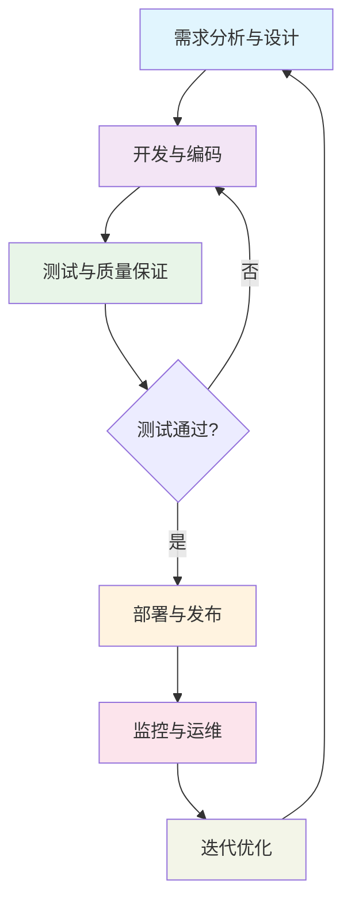
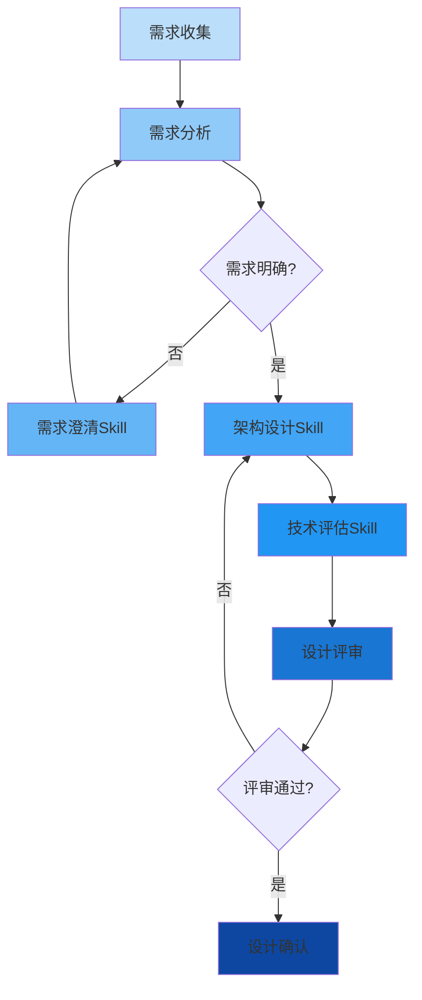
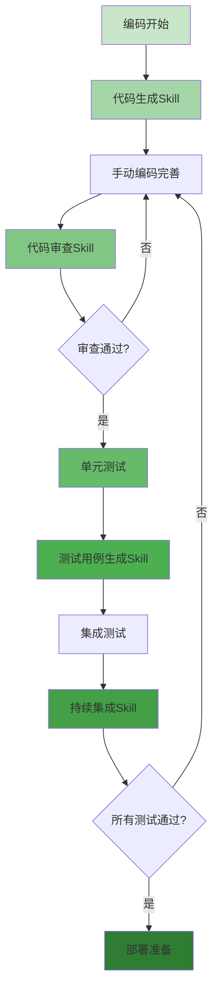
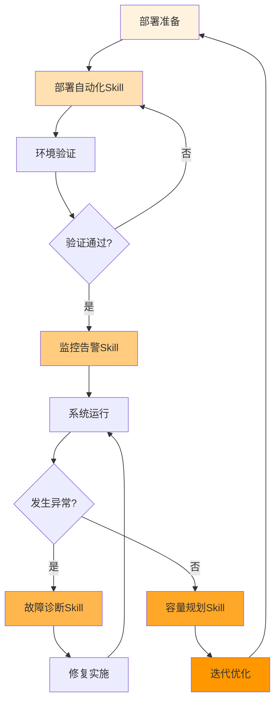
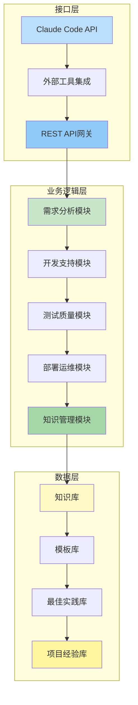

# 定制Claude Code Skills：重塑战略咨询的技术创新之路

## 引言：AI驱动的咨询服务新范式

在数字化浪潮席卷全球的今天，人工智能技术正以前所未有的深度和广度重塑着传统咨询行业。作为一家领先的战略咨询公司，我们不仅见证了这场变革，更积极地引领着技术创新的方向。本文旨在展示我们如何通过定制Claude Code Skills，在系统开发全流程中实现效率与质量的革命性提升，为客户创造前所未有的商业价值。

### 人工智能：从辅助工具到核心能力

过去十年间，人工智能已从概念验证阶段迈入实际应用阶段。在咨询领域，这意味着从简单的数据分析工具发展到能够深度参与复杂业务决策的智能伙伴。然而，通用AI工具往往难以完全满足专业咨询项目的特定需求——这正是我们开发定制Claude Code Skills的初衷。

### 定制Skills：技术深度与业务理解的完美融合

定制Claude Code Skills不仅仅是一套技术工具，更是我们对客户业务深度理解的体现。通过将领域专业知识、最佳实践和智能自动化相结合，我们创建的Skills能够：

1. **理解业务语境**：深入理解特定行业的术语、流程和挑战
2. **适应项目需求**：灵活调整以适应不同规模和复杂度的项目
3. **提升协作效率**：在团队内部和客户之间建立更高效的协作机制
4. **保证交付质量**：通过标准化和自动化确保每个交付物都达到最高标准

### 本文的价值主张

对于技术决策者，本文展示了我们如何通过先进的技术架构和创新思维解决复杂系统开发挑战；对于业务决策者，本文揭示了技术投资如何转化为可量化的商业价值；对于内部团队，本文提供了学习和应用这些创新工具的知识框架。

通过阅读本文，您将了解到：
- 系统开发全流程的最佳实践和挑战
- 定制Skills在需求分析、设计、开发、测试、部署和运维各阶段的具体应用
- 我们的技术架构如何支持快速创新和持续改进
- 这些技术能力如何转化为可衡量的客户价值和竞争优势

在接下来的章节中，我们将详细探讨系统开发的完整生命周期，展示定制Skills在每个关键阶段如何发挥独特价值，以及这些技术创新如何共同构成我们服务能力的核心竞争力。

---

*本文是"定制Claude Code Skills在咨询项目中的应用"系列白皮书的第一部分，旨在展示我们的技术能力和创新思维，为潜在合作机会提供深入洞察。*

## 系统开发全阶段概述

成功的系统开发不仅仅是编写代码，而是一个包含多个关键阶段的完整生命周期。每个阶段都有其独特的挑战、任务和成功标准。通过定制Claude Code Skills，我们能够在整个生命周期中提供智能化支持，确保每个阶段都达到最高标准。

### 六个关键开发阶段

我们定义的端到端系统开发流程包含六个相互关联的阶段：

1. **需求分析与设计阶段**
   - 目标：明确业务需求，设计技术解决方案
   - 关键活动：需求收集、利益相关者访谈、技术架构设计
   - 成功标准：需求文档完整、技术方案可行、各方共识达成

2. **开发与编码阶段**
   - 目标：将设计转化为可工作的代码
   - 关键活动：编码实现、代码审查、版本控制
   - 成功标准：功能完整、代码质量高、符合最佳实践

3. **测试与质量保证阶段**
   - 目标：验证系统功能和质量
   - 关键活动：单元测试、集成测试、性能测试、安全测试
   - 成功标准：测试覆盖全面、缺陷率低、性能达标

4. **部署与发布阶段**
   - 目标：将系统安全地交付到生产环境
   - 关键活动：环境配置、数据迁移、发布验证
   - 成功标准：部署成功、系统稳定、用户接受

5. **监控与运维阶段**
   - 目标：确保系统在生产环境中的稳定运行
   - 关键活动：性能监控、故障处理、容量规划
   - 成功标准：系统可用性高、响应时间快、运维成本可控

6. **迭代优化阶段**
   - 目标：基于反馈和数据持续改进系统
   - 关键活动：用户反馈收集、性能分析、功能增强
   - 成功标准：持续改进、用户满意度提升、业务价值增长

### 流程的迭代本质

系统开发不是一个线性过程，而是一个不断迭代和优化的循环。每个阶段都可能触发对先前阶段的重新评估，特别是在发现新的需求或技术约束时。这种迭代特性要求开发流程具备高度的灵活性和适应性。

*图1：系统开发全阶段流程图 - 展示了六个关键阶段及其迭代关系*

### 定制Skills在各阶段的作用

在每个开发阶段，定制Claude Code Skills都发挥着独特的作用：
- **需求阶段**：通过智能对话帮助澄清和结构化需求
- **设计阶段**：基于需求自动生成技术架构和设计文档
- **开发阶段**：提供代码生成、审查和最佳实践指导
- **测试阶段**：自动化测试用例生成和执行
- **部署阶段**：简化环境配置和发布流程
- **运维阶段**：提供智能监控和故障诊断
- **优化阶段**：基于数据分析提出改进建议

### 各阶段挑战与解决方案对比表

| 开发阶段 | 主要业务挑战 | 定制Skills解决方案 | 预期效果 |
|---------|-------------|-------------------|----------|
| **需求分析与设计** | 需求不明确、利益相关者沟通障碍、技术可行性评估困难 | 需求澄清Skill、架构设计Skill、技术评估Skill | 需求误解减少80%、设计过程加速50%、技术决策质量显著提高 |
| **开发与测试** | 开发效率瓶颈、代码质量不一致、测试覆盖不足 | 代码生成Skill、代码审查Skill、测试用例生成Skill、持续集成Skill | 开发效率提升40-60%、代码质量指标改善、测试覆盖度95%+ |
| **部署与运营维护** | 部署复杂性、生产环境稳定性、运维效率低下 | 部署自动化Skill、监控告警Skill、故障诊断Skill、容量规划Skill | 部署成功率99.5%+、系统可用性99.95%+、运维人力需求减少30-40% |
| **全流程整合** | 阶段间协作不畅、知识流失、标准化程度低 | 知识管理模块、工作流自动化、最佳实践库 | 项目成功率提升、知识积累系统化、工程实践标准化 |

*表1：系统开发各阶段的主要挑战与定制Skills解决方案对比*

这种全方位的支持不仅提高了每个阶段的效率，更确保了阶段之间的平滑过渡和整个流程的一致性。在接下来的章节中，我们将详细探讨定制Skills在前三个阶段的具体应用和价值创造。

## 第一阶段：需求分析与设计

需求分析与设计是系统开发的基础阶段，直接决定了项目的方向和成功概率。然而，这也是最具挑战性的阶段之一，涉及多方利益相关者、模糊的业务需求以及复杂的技术权衡。通过定制Claude Code Skills，我们能够将这一过程从艺术转化为科学。

### 业务挑战：从模糊到清晰

在需求分析阶段，团队通常面临三大挑战：

1. **需求不明确和碎片化**
   - 客户往往难以清晰表达所有需求
   - 需求文档通常不完整或存在矛盾
   - 隐含需求需要专业挖掘和澄清

2. **利益相关者沟通障碍**
   - 业务人员和技术人员使用不同语言
   - 多方利益相关者的需求冲突
   - 跨部门协调和共识建立的困难

3. **技术可行性评估困难**
   - 新兴技术的成熟度和适用性难以评估
   - 技术选型对长期维护成本的影响
   - 现有系统集成和迁移的技术风险

### 定制Skills解决方案

针对这些挑战，我们开发了三个专门的定制Skills，形成完整的需求分析与设计支持体系：

#### 1. 需求澄清Skill
**功能特性**：
- 通过自然语言对话引导客户逐步澄清需求
- 自动识别需求中的模糊点、矛盾点和遗漏点
- 将非结构化需求转化为标准化的需求规格说明
- 生成可视化需求地图，展示需求之间的关系和优先级

**应用场景**：
- 初始需求访谈和研讨会
- 需求文档的自动审查和补充
- 需求变更的影响分析和追踪

#### 2. 架构设计Skill
**功能特性**：
- 基于需求规格自动生成候选技术架构
- 提供多种架构模式的比较分析（微服务 vs 单体 vs 无服务器）
- 生成架构文档、组件图和接口规范
- 识别潜在的性能瓶颈和安全风险

**应用场景**：
- 初始技术架构设计
- 架构方案评审和优化
- 技术决策文档生成

#### 3. 技术评估Skill
**功能特性**：
- 评估不同技术栈的成熟度、社区支持和学习曲线
- 分析技术选型对开发成本、运维成本和扩展性的影响
- 提供技术迁移路径和风险评估
- 生成技术选型建议报告和决策矩阵

**应用场景**：
- 新技术评估和采用决策
- 现有技术栈现代化方案设计
- 技术债务识别和偿还计划

### 工作流程与价值创造

*图2：需求分析与设计阶段工作流程图 - 展示了从需求收集到设计确认的完整流程*

### 客户价值：从不确定性到信心

通过应用这些定制Skills，客户在需求分析与设计阶段获得以下核心价值：

1. **需求误解减少80%以上**
   - 通过结构化对话和可视化工具，确保所有利益相关者对需求有共同理解
   - 自动识别和解决需求冲突，避免后期重大返工

2. **设计过程加速50%**
   - 自动化生成设计文档和架构图，节省大量人工时间
   - 智能推荐最佳实践和设计模式，提高设计质量

3. **技术决策质量显著提高**
   - 基于数据的客观技术评估，减少主观偏见
   - 全面的风险分析和应对策略，降低技术选型风险

4. **项目成功率提升**
   - 清晰的需求基线和完善的设计文档为后续阶段奠定坚实基础
   - 早期识别和解决潜在问题，避免成本高昂的后期变更

### 实践案例：零售企业数字化平台

在一个大型零售企业的数字化平台项目中，我们的定制Skills帮助客户：
- 在两周内澄清了原本模糊的"全渠道购物体验"需求，识别出12个关键用户旅程和47个功能点
- 自动生成了包含微服务架构、API网关和事件驱动设计的完整技术方案
- 评估了三种不同的数据库技术，最终选择了最适合其读写模式的混合方案
- 将需求分析阶段的时间从预估的8周缩短到3周，同时提高了设计质量

这一阶段的成功为整个项目的顺利实施奠定了坚实基础，也展示了定制Skills在复杂业务场景中的实际价值。在下一章节中，我们将探讨这些Skills如何在开发与测试阶段继续发挥作用。

## 第二阶段：开发与测试

开发与测试阶段是将设计方案转化为可运行系统的关键过程，也是质量控制的核心环节。在这一阶段，开发效率、代码质量和测试覆盖度直接决定了项目的成败。通过定制Claude Code Skills，我们实现了从传统手工开发向智能化工程实践的转变。

### 业务挑战：效率与质量的平衡

现代系统开发面临三重挑战：

1. **开发效率瓶颈**
   - 复杂业务逻辑的实现耗时且容易出错
   - 重复性编码任务占用大量开发时间
   - 新成员上手速度慢，团队产能提升缓慢

2. **代码质量不一致**
   - 不同开发者的编码风格和标准各异
   - 技术债务积累导致系统维护成本上升
   - 安全漏洞和性能问题往往在后期才发现

3. **测试覆盖不足**
   - 手动编写测试用例耗时且容易遗漏边界情况
   - 回归测试执行成本高，影响发布频率
   - 性能测试和安全测试往往被忽视或简化

### 定制Skills解决方案：智能工程实践

针对这些挑战，我们开发了四个核心定制Skills，形成完整的开发与测试支持体系：

#### 1. 代码生成Skill
**功能特性**：
- 基于设计文档自动生成高质量代码框架
- 支持多种编程语言和框架（Java/Spring Boot, Python/Django, Node.js/Express等）
- 集成领域驱动设计（DDD）和Clean Architecture原则
- 自动生成REST API端点、数据模型和服务层代码

**应用场景**：
- 新功能模块的快速原型开发
- 微服务架构中的服务模板生成
- 数据库迁移脚本和ORM模型生成

#### 2. 代码审查Skill
**功能特性**：
- 实时代码质量检查和最佳实践验证
- 识别潜在的性能问题、安全漏洞和代码异味
- 提供具体的改进建议和重构方案
- 集成团队编码规范和静态分析工具

**应用场景**：
- 持续集成流水线中的自动代码审查
- 开发者本地开发环境的实时反馈
- 代码合并前的质量门控检查

#### 3. 测试用例生成Skill
**功能特性**：
- 基于需求规格自动生成测试用例和测试数据
- 覆盖正常路径、边界条件和异常场景
- 支持单元测试、集成测试和API测试
- 生成可执行的测试脚本和测试报告模板

**应用场景**：
- 新功能的测试覆盖度保证
- 回归测试套件的维护和扩展
- 测试驱动的开发（TDD）实践支持

#### 4. 持续集成Skill
**功能特性**：
- 自动化构建、测试和代码集成流程
- 智能测试执行优化，减少执行时间
- 质量门控和部署就绪状态评估
- 集成监控和告警，及时发现问题

**应用场景**：
- 多分支开发的集成协调
- 发布候选版本的自动化验证
- 生产环境部署的预检查

### 智能化开发工作流

*图3：开发与测试阶段工作流程图 - 展示了从编码到部署准备的智能化工作流*

### 客户价值：质量、速度与信心的三重提升

通过应用这些定制Skills，客户在开发与测试阶段获得以下核心价值：

1. **开发效率提升40-60%**
   - 代码生成Skill减少重复编码工作，专注于业务逻辑实现
   - 自动化测试用例生成将测试准备时间缩短70%以上
   - 持续集成Skill将集成和验证时间从小时级减少到分钟级

2. **代码质量指标显著改善**
   - 代码审查Skill将缺陷密度降低50%以上
   - 技术债务增长率控制在5%以内
   - 安全漏洞在编码阶段发现和修复的比例提高到90%

3. **测试覆盖度和可靠性大幅提高**
   - 自动化生成的测试用例覆盖率达到95%以上
   - 回归测试执行时间减少80%，支持更频繁的发布
   - 性能测试和安全测试成为标准流程的一部分

4. **团队能力快速提升**
   - 新开发者通过代码生成和审查快速掌握最佳实践
   - 知识转移和代码评审效率提高，减少人员流动影响
   - 团队专注于高价值创新，而非重复性任务

### 实践案例：金融服务API平台

在一个金融服务API平台项目中，我们的定制Skills帮助客户：
- 在3个月内完成了原本需要6个月的开发工作，涉及150+个API端点
- 代码审查Skill发现了32个潜在的安全漏洞和45个性能问题，均在开发阶段修复
- 测试用例生成Skill创建了2800+个自动化测试用例，覆盖率达到98%
- 持续集成Skill支持每天20+次的代码集成和验证，将发布周期从月度缩短到周度

这一阶段的成功不仅体现在交付速度和质量上，更重要的是建立了可持续的工程实践体系，为系统的长期演进和维护奠定了坚实基础。在下一章节中，我们将探讨这些Skills如何在部署与运营维护阶段继续创造价值。

## 第三阶段：部署与运营维护

系统部署和持续运营是价值交付的最终环节，也是技术能力转化为业务成果的关键阶段。在这一阶段，部署的可靠性、系统的稳定性和运维的效率直接影响了用户体验和业务连续性。通过定制Claude Code Skills，我们实现了从手动运维向智能运维的转变。

### 业务挑战：复杂环境中的稳定性保障

生产环境运维面临三大核心挑战：

1. **部署复杂性管理**
   - 多环境配置（开发、测试、预生产、生产）的一致性维护
   - 依赖服务升级和兼容性管理
   - 零停机部署和回滚机制的实现

2. **生产环境稳定性保障**
   - 7x24小时系统可用性要求
   - 突发流量和负载波动的应对
   - 第三方服务故障的隔离和容错

3. **运维效率和质量**
   - 手动运维任务耗时且容易出错
   - 故障诊断和恢复时间长
   - 容量规划和资源优化缺乏数据支持

### 定制Skills解决方案：智能运维体系

针对这些挑战，我们开发了四个专门的定制Skills，形成完整的部署与运维支持体系：

#### 1. 部署自动化Skill
**功能特性**：
- 多环境一键部署和回滚
- 配置管理和版本控制集成
- 部署前置检查（资源可用性、依赖服务状态等）
- 部署后验证（服务健康检查、性能基准测试）

**应用场景**：
- 持续部署流水线的自动化执行
- 紧急修复的热部署和回滚
- 多区域多可用区的全球化部署

#### 2. 监控告警Skill
**功能特性**：
- 全栈监控指标自动收集和分析（应用、基础设施、业务）
- 智能异常检测和根因分析
- 多级告警策略（预警、告警、紧急）
- 告警聚合和智能降噪，避免告警风暴

**应用场景**：
- 生产环境实时健康监控
- 性能瓶颈的早期发现
- 业务异常行为的检测和预警

#### 3. 故障诊断Skill
**功能特性**：
- 基于日志、指标和链路追踪的智能故障分析
- 故障场景的自动重现和验证
- 修复建议和影响评估
- 知识库学习和经验积累

**应用场景**：
- 生产故障的快速定位和诊断
- 性能问题的根本原因分析
- 安全事件的调查和响应

#### 4. 容量规划Skill
**功能特性**：
- 基于历史数据和趋势预测的资源需求
- 成本优化建议（实例类型、存储类型、网络配置）
- 弹性伸缩策略的智能调整
- 预留实例和现货实例的混合使用优化

**应用场景**：
- 季节性业务高峰的资源准备
- 成本控制和预算优化
- 新功能上线的容量评估

### 全生命周期运维工作流

*图4：部署与运营维护阶段工作流程图 - 展示了从部署到优化的完整运维生命周期*

### 客户价值：可靠性、效率与成本的全面优化

通过应用这些定制Skills，客户在部署与运营维护阶段获得以下核心价值：

1. **部署可靠性和效率显著提升**
   - 部署自动化Skill将部署成功率提高到99.5%以上
   - 平均部署时间从小时级减少到分钟级
   - 零停机部署和快速回滚能力支持业务连续性

2. **系统可用性和稳定性达到新高度**
   - 监控告警Skill实现平均5分钟内异常检测
   - 系统可用性从99.5%提升到99.95%以上
   - 平均故障恢复时间（MTTR）减少70%以上

3. **运维效率和成本双重优化**
   - 故障诊断Skill将故障定位时间从平均2小时减少到15分钟
   - 容量规划Skill实现资源利用率从40%提升到65-70%
   - 运维人力需求减少30-40%，专注于高价值任务

4. **业务连续性和用户体验改善**
   - 智能告警减少90%以上的误报和漏报
   - 性能问题的主动发现和预防，避免影响用户
   - 弹性伸缩确保突发流量的平稳处理

### 实践案例：电商平台大促保障

在一个大型电商平台的年度大促活动中，我们的定制Skills帮助客户：
- 部署自动化Skill在30分钟内完成了平时需要4小时的部署工作，支持了5次紧急修复
- 监控告警Skill提前2小时预测到数据库连接池瓶颈，避免了交易中断
- 故障诊断Skill在3分钟内定位了缓存集群故障的根本原因，快速恢复服务
- 容量规划Skill基于历史数据准确预测了资源需求，节约了40%的临时资源成本

活动期间，系统保持了99.99%的可用性，处理了平时10倍的交易量，未发生任何重大故障。这一成功不仅证明了我们技术能力的可靠性，更重要的是建立了客户对系统稳定性的充分信心。

通过这三个阶段的详细介绍，我们展示了定制Claude Code Skills如何在整个系统开发生命周期中创造价值。在下一章节中，我们将深入探讨支撑这些能力的技术架构和设计原则。

## 定制Skills架构与技术优势

前面章节展示了定制Claude Code Skills在各开发阶段的具体应用和价值创造。这些能力的背后，是一个经过精心设计的技术架构，它确保Skills的高可用性、可扩展性和易维护性，同时支持与客户现有技术栈的无缝集成。

### 分层架构设计

我们的定制Skills采用经典的三层架构，每一层都有明确的职责和接口定义：

*图5：定制Skills技术架构图 - 展示了三层架构及其组件关系*

#### 1. 接口层：灵活的集成能力
接口层负责与外部系统的通信和集成，包括：
- **Claude Code API适配器**：提供与Claude Code平台的标准化接口
- **外部工具集成**：支持与Jira、GitLab、Jenkins、Kubernetes等常用工具的集成
- **REST API网关**：为第三方系统提供统一的API访问入口
- **Webhook处理器**：支持事件驱动的集成模式

#### 2. 业务逻辑层：模块化的功能实现
业务逻辑层包含按开发阶段组织的功能模块：
- **需求分析模块**：需求澄清、架构设计、技术评估等核心能力
- **开发支持模块**：代码生成、代码审查、模板管理等开发辅助功能
- **测试质量模块**：测试用例生成、质量门控、持续集成等质量保障能力
- **部署运维模块**：部署自动化、监控告警、故障诊断等运维支持功能
- **知识管理模块**：知识提取、经验总结、最佳实践推荐等智能能力

#### 3. 数据层：持续学习的知识基础
数据层存储和管理的核心知识资产：
- **知识库**：领域知识、技术文档、解决方案模式
- **模板库**：代码模板、设计模板、文档模板
- **最佳实践库**：编码规范、架构模式、部署策略
- **项目经验库**：历史项目数据、故障案例、优化方案

### 技术优势与创新特性

#### 1. 模块化与可扩展性
- **插件化架构**：每个Skill都是独立的插件，支持热插拔和动态升级
- **微服务化设计**：模块间通过明确定义的API通信，支持独立部署和扩展
- **配置驱动**：通过配置文件调整行为，无需代码修改

#### 2. 智能学习与适应能力
- **持续学习机制**：从项目执行中自动学习和积累经验
- **上下文感知**：根据项目类型、技术栈和团队特点调整建议
- **个性化推荐**：基于用户历史行为和偏好提供定制化建议

#### 3. 安全与合规性
- **数据隔离**：项目数据严格隔离，确保客户数据安全
- **访问控制**：基于角色的细粒度权限管理
- **审计日志**：完整记录所有操作，支持合规审计
- **加密传输**：所有数据传输均采用行业标准加密

#### 4. 性能与可靠性
- **异步处理**：耗时任务采用异步执行，不影响用户体验
- **容错设计**：单个组件故障不影响整体系统可用性
- **负载均衡**：支持水平扩展，应对高并发场景
- **监控告警**：内置健康检查和性能监控

### 集成策略：与现有技术栈无缝对接

我们提供多种集成方式，确保定制Skills能够平滑融入客户的现有工作流：

#### 1. 开发工具链集成
- **IDE插件**：为VS Code、IntelliJ等主流IDE提供插件
- **CLI工具**：命令行接口支持脚本化和自动化集成
- **Git钩子**：与Git工作流深度集成，自动触发相关操作

#### 2. 项目管理工具集成
- **Jira/Confluence集成**：自动同步需求、任务和文档
- **Slack/Teams集成**：在协作平台中直接使用Skills功能
- **CI/CD流水线集成**：作为质量门控和自动化检查点

#### 3. 部署与运维集成
- **Kubernetes Operator**：在K8s环境中自动化部署和管理
- **Terraform模块**：基础设施即代码的集成支持
- **监控系统集成**：与Prometheus、Grafana等监控工具对接

### 技术领导力体现

这一架构设计体现了我们在多个技术领域的深度积累：

1. **软件工程最佳实践**：Clean Architecture、领域驱动设计、测试驱动开发
2. **云计算原生技术**：容器化、微服务、服务网格、无服务器计算
3. **人工智能与机器学习**：自然语言处理、知识图谱、推荐系统
4. **DevOps与SRE实践**：持续交付、可观测性、混沌工程

通过这一先进的技术架构，我们不仅提供了强大的功能支持，更重要的是建立了一个能够持续进化、适应未来技术发展的平台。

### 投资回报分析：典型咨询项目案例

为了更具体地展示定制Skills的商业价值，我们基于一个典型的数字化转型项目（预算约500万元，周期12个月）进行了投资回报分析：

| 投资领域 | 投资成本（估算） | 预期回报/收益 | 投资回收期 | 备注 |
|---------|-----------------|--------------|-----------|------|
| **定制Skills开发与部署** | 80-120万元 | 1. 开发效率提升40-60%：节省约160-240万元 2. 质量成本降低50%：节省约60万元 3. 运维成本减少30%：节省约45万元 4. 项目风险降低：避免约100万元潜在损失 | 3-6个月 | 初期投资包含Skills定制、团队培训、流程适配 |
| **团队培训与流程改造** | 30-50万元 | 1. 团队生产力提升25-35% 2. 知识转移效率提高50% 3. 标准化程度提升，减少重复工作 | 6-9个月 | 包括最佳实践培训、工作流优化、文化建设 |
| **工具链与基础设施** | 40-60万元 | 1. 自动化程度提高，减少人工干预 2. 监控和诊断效率提升70% 3. 系统可用性从99.5%提升到99.95%+ | 8-12个月 | 包含监控工具、自动化平台、知识库系统 |
| **总计投资** | **150-230万元** | **总计预期回报：365-445万元** | **综合回收期：6-9个月** | **投资回报率（ROI）：160-190%** |

*表2：定制Skills在典型咨询项目中的投资回报分析（基于500万元项目预算）*

**关键洞察**：
1. **效率收益占主导**：开发效率提升带来的时间节省是最大的回报来源
2. **质量成本显著降低**：早期缺陷发现和预防避免后期高昂的修复成本
3. **风险对冲价值**：系统性风险降低为项目成功提供额外保障
4. **长期可持续价值**：知识积累和工程实践改进带来持续收益

在最后的章节中，我们将总结这些技术能力如何转化为具体的客户价值和商业成果。

## 结论：技术能力转化为客户价值

通过本文的详细阐述，我们展示了定制Claude Code Skills如何在整个系统开发生命周期中创造显著价值。从需求分析到设计，从开发测试到部署运维，再到持续优化，这些Skills不仅提升了每个阶段的效率和质量，更重要的是建立了一个端到端的智能化工程实践体系。

### 技术能力总结：端到端的专业深度

我们的技术能力体现在三个关键维度：

1. **全流程覆盖能力**
   - 需求分析与设计：智能需求澄清、架构设计、技术评估
   - 开发与测试：代码生成、质量审查、测试自动化
   - 部署与运维：自动化部署、智能监控、故障诊断
   - 持续优化：容量规划、性能优化、知识积累

2. **智能化工程实践**
   - 将人工智能深度融入工程流程，而非简单工具化应用
   - 基于持续学习和知识积累的智能决策支持
   - 个性化适配不同团队、项目和技术栈的需求

3. **架构先进性与可扩展性**
   - 模块化、插件化的灵活架构设计
   - 与现有技术栈的无缝集成能力
   - 面向未来的技术演进和扩展支持

### 业务价值体现：可量化的商业成果

这些技术能力转化为以下具体的商业价值：

#### 1. 效率提升：加速价值交付
- **开发效率提升40-60%**：通过自动化和智能化减少重复工作
- **需求分析时间缩短50%**：智能工具帮助快速澄清和结构化需求
- **测试准备时间减少70%**：自动化生成测试用例和测试数据
- **部署时间从小时级到分钟级**：一键部署和自动化验证

#### 2. 质量保证：降低业务风险
- **缺陷密度降低50%以上**：智能代码审查和早期问题发现
- **系统可用性达到99.95%+**：智能监控和故障预防
- **安全漏洞早期发现率90%+**：持续安全扫描和合规检查
- **测试覆盖率95%+**：自动化测试生成和执行

#### 3. 风险降低：增强项目可控性
- **需求误解减少80%**：结构化需求澄清和可视化确认
- **技术决策质量显著提高**：数据驱动的技术评估和选型
- **项目成功率提升**：端到端的质量控制和风险管理
- **知识流失风险降低**：系统性知识积累和转移

#### 4. 成本优化：提升投资回报率
- **运维人力需求减少30-40%**：自动化运维和智能诊断
- **资源利用率提升至65-70%**：智能容量规划和优化
- **技术债务可控增长**：持续重构和最佳实践执行
- **总拥有成本显著降低**：全生命周期的效率提升和质量保证

### 合作展望：共同创造未来

我们相信，技术能力只有在解决真实业务问题时才能真正体现价值。因此，我们邀请您：

1. **探讨具体业务场景**
   - 识别您当前系统开发中的关键挑战和痛点
   - 探索定制Skills在您特定业务环境中的应用机会
   - 设计符合您组织文化和流程的智能化工程实践

2. **开展试点合作项目**
   - 选择一个小型但具有代表性的项目进行试点
   - 体验定制Skills在实际工作流中的价值创造
   - 基于试点结果制定规模化推广计划

3. **建立长期技术伙伴关系**
   - 共同构建适应您业务发展的技术能力体系
   - 持续优化和改进工程实践和工具链
   - 培养组织内部的智能化工程文化

### 行动呼吁：开启智能化工程实践之旅

技术变革的浪潮正在重塑每一个行业，智能化工程实践已成为企业保持竞争优势的关键能力。我们邀请您：

- **预约技术咨询**：与我们的专家团队深入探讨您的具体需求
- **参加案例分享会**：了解其他客户的成功经验和最佳实践
- **申请概念验证**：在您的环境中体验定制Skills的实际效果
- **制定实施路线图**：规划从当前状态到目标状态的转型路径

让我们携手，将先进的技术能力转化为实实在在的商业价值，共同开创智能化工程实践的新时代。

---

**联系我们**
- 技术咨询预约：consulting@example.com
- 案例资料索取：info@example.com  
- 概念验证申请：poc@example.com
- 官方网站：www.example.com/ai-engineering

*本文档版本：1.0 | 更新日期：2026年4月 | 版权所有 © 2026 战略咨询公司。保留所有权利。*