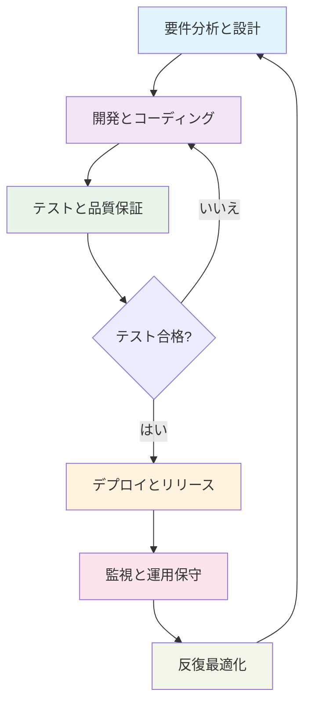

# Claude CodeカスタムSkillsを活用したコンサルティングプロジェクト応用ホワイトペーパー設計

## プロジェクト概要

本文書は、複合的な読者層（社内関係者と潜在顧客）向けの技術ホワイトペーパーを設計するもので、戦略コンサルティング会社がカスタムClaude Code Skillsを通じてシステム開発全プロセスの効率を向上させ、会社の技術的深さをアピールし、潜在的な提案機会を獲得する方法を示します。

### コア要件
- **対象読者**：複合読者層（社内関係者 + 既存顧客 + 潜在顧客）
- **記事フォーマット**：技術ホワイトペーパー/詳細分析（2000-3000字）
- **表示内容**：システム開発全段階（設計、コーディング、テスト、デプロイ、運用保守）
- **Skillsタイプ**：カスタム開発skills
- **業務分野**：特定制限なし（汎用システム開発プロセス）
- **価値提案**：技術能力の展示
- **記事スタイル**：混合バランス型（技術と業務の両立）
- **視覚要素**：Mermaid形式フローチャート、token消費を最小化

## 記事構造設計

### 1. 序論：AI駆動のコンサルティングサービス新時代（約300字）
- **オープニング**：人工知能技術が従来のコンサルティング業界をどのように変革しているか
- **核心的見解**：カスタムClaude Code Skillsは技術的深さと業務理解の最適な結合点
- **記事目的**：会社がカスタムSkillsを通じてシステム開発全プロセスの効率と品質を向上させる方法を示す
- **読者価値**：複雑なシステム開発におけるAIツールの戦略的価値の理解支援

### 2. システム開発全段階概要（約400字 + Mermaidフローチャート）
- **ライフサイクル定義**：エンドツーエンドシステム開発の6つの重要段階
- **段階区分**：
  1. 要件分析と設計段階
  2. 開発とコーディング段階
  3. テストと品質保証段階
  4. デプロイとリリース段階
  5. 監視と運用保守段階
  6. 反復最適化段階
- **プロセス関係**：各段階間の依存関係と反復サイクル
- **可視化**：Mermaidフローチャートによる完全なワークフローの表示

### 3. 第一段階：要件分析と設計（約500-600字 + Mermaidサブフローチャート）
- **業務課題**：要件不明確、ステークホルダーコミュニケーション障害、技術的実現可能性評価の困難
- **カスタムSkills解決策**：
  - **要件明確化Skill**：自然言語対話を通じて顧客の要件を明確化・構造化
  - **アーキテクチャ設計Skill**：要件に基づく技術アーキテクチャ図と設計文書の自動生成
  - **技術評価Skill**：異なる技術スタックの長所・短所と実現可能性の評価
- **顧客価値**：要件誤解の減少、設計プロセスの加速、技術的意思決定の質向上
- **ワークフローチャート**：要件分析から設計承認までの詳細なプロセスの表示

### 4. 第二段階：開発とテスト（約500-600字 + Mermaidサブフローチャート）
- **業務課題**：開発効率のボトルネック、コード品質の不一致、テストカバレッジ不足
- **カスタムSkills解決策**：
  - **コード生成Skill**：設計文書に基づく高品質コードフレームワークの生成
  - **コードレビューSkill**：自動化されたコード品質チェックとベストプラクティス検証
  - **テストケース生成Skill**：要件に基づくテストケースとシナリオの自動生成
  - **継続的インテグレーションSkill**：自動化されたビルド、テスト、コード統合プロセス
- **顧客価値**：開発効率の向上、コード品質の確保、回帰障害の減少
- **ワークフローチャート**：開発からテストまでの反復プロセスの表示

### 5. 第三段階：デプロイと運用保守（約500-600字 + Mermaidサブフローチャート）
- **業務課題**：デプロイの複雑性、本番環境の安定性、運用効率の低さ
- **カスタムSkills解決策**：
  - **デプロイ自動化Skill**：自動化されたデプロイプロセスと環境設定
  - **監視アラートSkill**：システム健全性とパフォーマンス指標のリアルタイム監視
  - **障害診断Skill**：ログと監視データに基づくインテリジェントな障害分析
  - **容量計画Skill**：使用パターンに基づくリソース最適化提案
- **顧客価値**：システム信頼性の向上、運用コストの削減、リソース利用の最適化
- **ワークフローチャート**：デプロイから運用までの完全なライフサイクルの表示

### 6. カスタムSkillsアーキテクチャと技術的優位性（約400字 + Mermaidアーキテクチャ図）
- **技術アーキテクチャ**：カスタムSkillsの階層化アーキテクチャ設計
  - **インターフェース層**：Claude Codeと既存ツールとの統合インターフェース
  - **業務ロジック層**：各段階専用の業務ロジック実装
  - **データ層**：ナレッジベース、テンプレートライブラリ、ベストプラクティスライブラリ
- **統合戦略**：顧客の既存技術スタックとのシームレスな統合方法
- **拡張性設計**：モジュラーアーキテクチャによる新機能の迅速な拡張サポート
- **セキュリティ考慮**：データセキュリティとアクセス制御メカニズム

### 7. 結論：技術能力から顧客価値への転換（約300字）
- **技術能力のまとめ**：エンドツーエンドシステム開発全プロセスの専門的能力
- **業務価値の具現化**：
  - **効率向上**：自動化による人的作業の減少、プロジェクト納期の短縮
  - **品質保証**：標準化されたプロセスとベストプラクティスによる納品品質の向上
  - **リスク低減**：早期検証と継続的監視によるプロジェクトリスクの減少
  - **コスト最適化**：リソース最適化とプロセス改善による総コストの削減
- **協業の展望**：具体的な業務シナリオと応用機会についての顧客との対話の招待
- **行動喚起**：技術コンサルティングとカスタムSkills開発サービスの提供

## 視覚要素計画

### フローチャート設計（すべてMermaid形式を使用）
1. **図1**：システム開発全段階総合フローチャート（既包含）
2. **図2**：要件分析と設計段階の詳細フローチャート
3. **図3**：開発とテスト段階の詳細フローチャート
4. **図4**：デプロイと運用保守段階の詳細フローチャート
5. **図5**：カスタムSkills技術アーキテクチャ図（既包含）

### テーブル設計
1. **表1**：各段階の業務課題とカスタムSkills解決策の比較表
2. **表2**：典型的なコンサルティングプロジェクトにおけるカスタムSkillsの投資収益率分析

## コンテンツ戦略

### 技術的深さと業務価値のバランス
- **技術記述**：カスタムSkillsの動作原理と実装メカニズムの詳細な説明
- **業務関連性**：技術が具体的な業務課題をどのように解決するかの常時強調
- **事例引用**：汎用的だが具体的なシナリオを使用した応用価値の説明
- **データサポート**：定量化された効率向上と品質改善データの提供

### 読者適応性
- **技術的意思決定者**：アーキテクチャ設計、統合能力、技術的優位性に注目
- **業務的意思決定者**：投資収益率、リスク低減、効率向上に注目
- **社内チーム**：ワークフロー改善とスキル向上機会に注目

## 成功基準

### コンテンツ品質基準
- ✅ システム開発全段階の完全なカバレッジ
- ✅ カスタムSkillsの技術アーキテクチャの明確な表示
- ✅ 技術的深さと業務価値の効果的なバランス
- ✅ 実践可能な洞察と提案の提供

### 業務目標基準
- ✅ 会社の技術能力と革新的思考の展示
- ✅ 潜在的な提案機会のための導入点の創出
- ✅ 業界技術リーダーシップイメージの確立
- ✅ 社内ナレッジ共有とスキル向上の促進

---

*設計完了日：2026-04-07*  
*次ステップ：ユーザーによる設計文書のレビュー、確認後のコンテンツ作成開始*